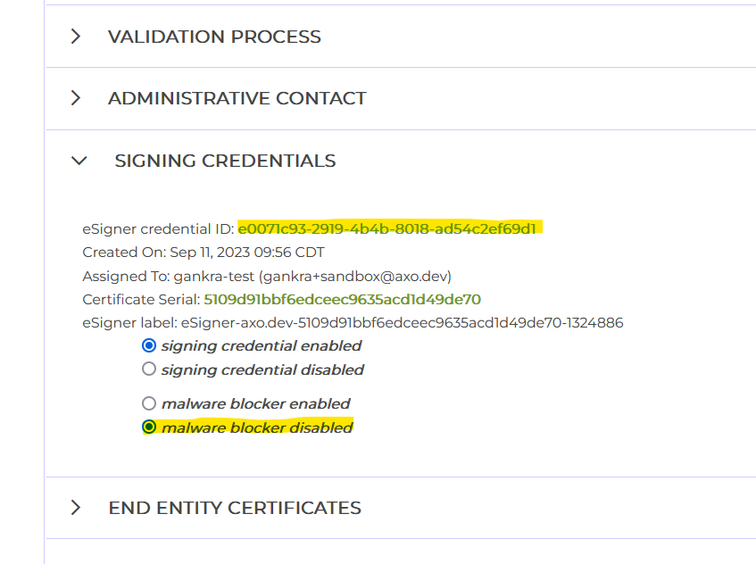

# Signing and Attestation

## Windows Artifact Signing with SSL.com Certificates

> since 0.15.0

### Quickstart

#### Part 1: Create an SSL.com certifcate and/or a sandbox account

1. **Make an account and order your certificate**

    Visit https://ssl.com or https://sandbox.ssl.com/login. You will need to select an "eSigner Extended Validation (EV) Code Signing Certificate".

    If you are creating a sandbox account, you may need to email support several times to have your test certificate validated *and* issued.


2. **Enroll in eSigner Cloud Signing**

    Go to "certificate details": You should see a prompt to a enter and confirm a PIN to setup an OTP login.

    **BE SURE TO SAVE THE TOTP SECRET CODE THAT APPEARS UNDER THE QR CODE FOR YOUR OTP APP, YOUR CI WILL NEED THIS.**

    

3. **Get your credential ID**

    The credential ID will be how we let CI know what certificate to use.

    

4. **(optional but strongly recommended) Disable malware blocker**

    In our testing and discussions with SSL.com support, it seems that this feature simply doesn't work.

#### Part 2: Enable SSL.com signing with cargo-dist

1. **Install or update cargo-dist**.

    Make sure you have `cargo-dist v0.15.0` or later. If you already have `cargo-dist` installed, you can check what version you have with `cargo dist -V` and `run `cargo dist selfupdate` to update.
1. **Ensure you have the `"authors"` and `"respository"` fields set in your `Cargo.toml` or `dist.toml`.**

    msi requires you to specify a "manufacturer" for you application, which is by default sourced from the `"authors"` field in your configuration. If you don’t have that field set, later steps will error out. `cargo-dist` will also refuse to setup ci stuff if the `"repository"` field isn’t set and pointing at your Github repo.
1. **Setup cargo-dist in your project**

    In the root of your workspace, run `cargo dist init`, which will bring up an interactive prompt.

    Most of the defaults should be good — the only thing that specifically needs to be changed is you want to enable the “msi” installer.

    Once `init` completes it will create several files, and edit some config into your Cargo.toml, and these all should be checked in:

    - `.github/workflows/release.yml` will be created, this is your Release CI. It will run:
        - `on: pull_request``  will run `cargo dist plan` to do some basic integrity checks. it will not create actual releases
        - `on: push (tag)` will be your full release process
    - `wix/main.wxs` will be created, this is the definition of your msi
    - `Cargo.toml` will have several sections appended
        - `[profile.dist]` is the profile your release builds will use
        - `[workspace.metadata.dist]` is the config for cargo-dist
        - `[workspace.metadata.wix]` is the config for cargo-wix (msi tool)
1. **Configure cargo-dist to codesign**

    Add the following to your `Cargo.toml` or `dist.toml`:

    ```toml
    # Config for 'cargo dist'
    [workspace.metadata.dist]
    ...
    ssldotcom-windows-sign = "prod" # or "test" if you are using a sandbox account
    ```


#### Part 3: Setup Github Actions with the necessary secrets

- `SSLDOTCOM_USERNAME`: the username of your ssl.com account
- `SSLDOTCOM_PASSWORD`: the password to you ssl.com account
- `SSLDOTCOM_TOTP_SECRET`: this is the totp “secret code” from Part 1 Step 2
- `SSLDOTCOM_CREDENTIAL_ID`: this is the “credential id” from Part 1 Step 3

For reference, the SSL.com documentation uses the names:  ES_USERNAME, ES_PASSWORD, ES_TOTP_SECRET, and CREDENTIAL_ID for these values. The “ES” stands for “esign”. We renamed these variables to make them more specific and clear.

#### Part 4: You're done!

Once you have an `artifacts.zip` (from an actions run), or a (pre)release, you can download and run the MSI on a Windows machine. If you used a valid production EV certificate, you should not see a Windows defender screen!

If you used a sandbox account, or the signing failed, you will see the Windows defender screening. If you successfully signed you artifact with a sandbox account you will see this:


